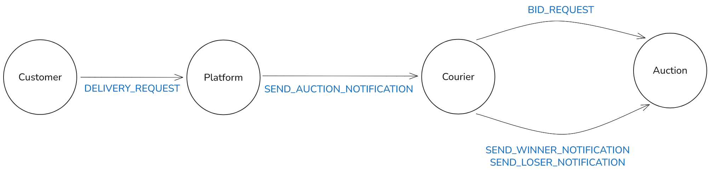

# Transport Agents Simulator

A modular event‑driven simulation framework for experimenting with transport and parcel‑delivery systems. 
This project aims to study the impacts of freight transport on bus delays and identify different market auction strategies that incentivize optimal courier behavior.
The simulation is based on a graph-based road network. 

---

## Core concepts

### Simulation kernel
- The kernel drives simulated time
- Events are scheduled and processed in order
- Logs of events of interest are saved

### Agents and entities
- Entities are identifiable objects in the simulation
- Agents are entities that act and react, they communicate to other agents via messages

### Environment
- The transport network is a graph of nodes and edges
- Distances, travel times, and paths live here

### Models
- Pure data containers (parcels, bids, stops)
- No side effects, no simulation logic

---

## Specific components

- **Bus** is the entity that represents a bus and must transport passengers to their destinations through a specific route
- **Customer** is the agent that requests the delivery of a parcel to the platform
- **Platform** is the agent that manages parcel requests, generates auctions, and assigns parcels to couriers
- **Auction** is the agent that receives bids and determines the winner courier
- **Courier** is the agent that participates in auctions and delivers parcels from their origin to their destination

Below is a diagram representing the communication between agents:



---

## Running an example

From the project root:

```bash
python examples/toy.py
```

This builds a small network, creates agents, schedules events, and runs the simulation end‑to‑end.
At the end of the simulation, logs of the following will be written:

- `event_log.csv`: tracks each event related to an auction and a delivery
- `edge_log.csv`: tracks the time at which each vehicle entered and exited an edge in the network
- `alert_log.csv`: tracks the time courier enters an edge with one or more buses currently traveling it

